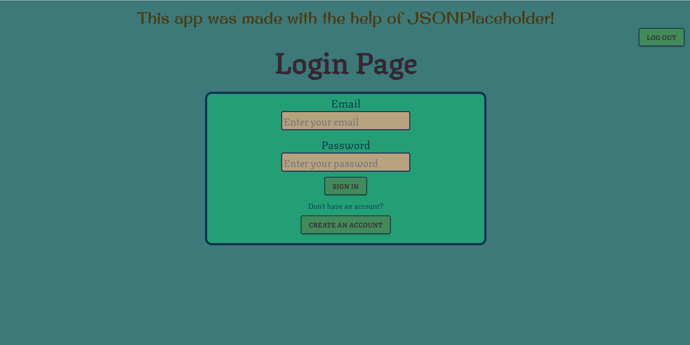

# Fake Posts

## Fake posts is an application that displays users, their posts and comments to them. Data can be added, deleted or corrected after logging in. All of the app's information is stored in the database.

> After you cloned the application to your computer, in the project directory run
> ### `npm install`
> to install all dependencies for the project.
> To start the project run
> ### `npm start`
> and use it in opened browser window with application.
>
> The page will reload if you make edits.\
> You will also see any errors in the console.